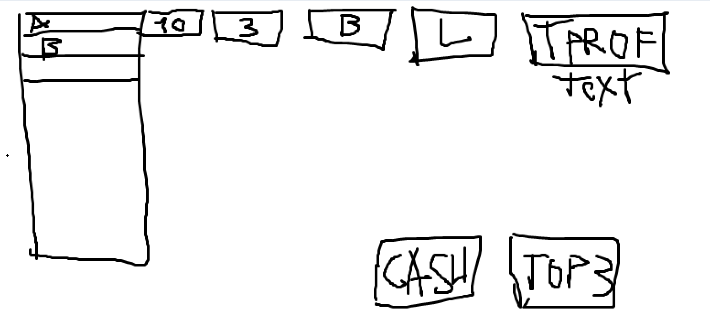

# horse-profit


## DTOs

### Horse
```json
{
  "horseId": 1,
  "name": "Silver Lightning",
  "stake": "10",
  "step": 3,
  "profit": 7500.00
}
```

### Order
```json
{
  "horseId": 1,
  "stake": "10",
  "step": 3,
  "betType": "back"
}
```

### TradeService methods
```
List<Horse> getAllHorses(raceId);
void horseBet(Order)
void horseBet(List<Order>)
void cashOut(List<Horse>)
void moveToTop3()
```
