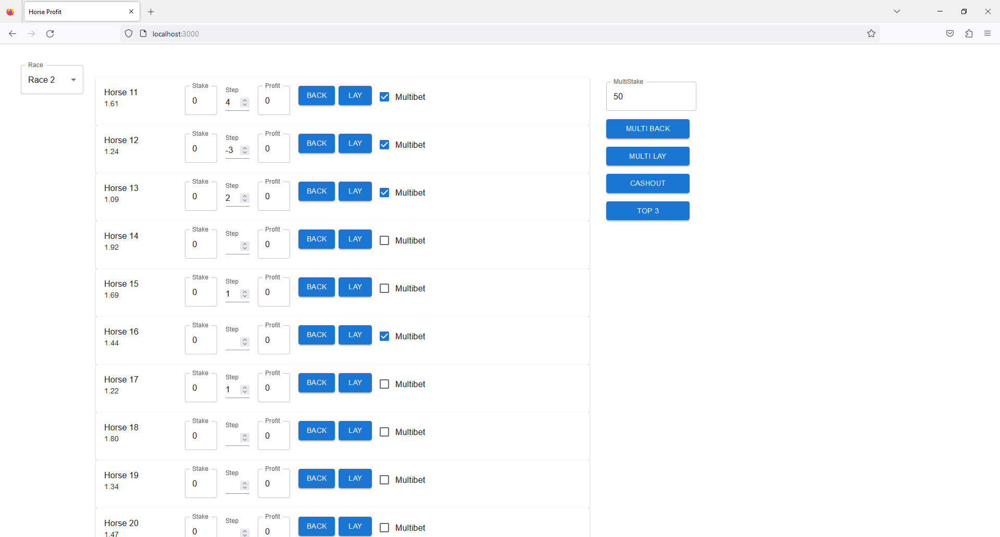

# horse-profit


## DTOs

### Horse
```json
{
  "horseId": 1,
  "name": "Silver Lightning",
  "stake": "10",
  "step": 3,
  "profit": 7500.00
}
```

### Bet
```json
{
  "horseId": 1,
  "stake": "10",
  "step": 3,
  "betType": "back"
}
```

### TradeService methods
```
List<Horse> getAllHorses(raceId);
void horseBet(Bet)
void horseBet(List<Bet>)
void cashOut(List<Horse>)
void moveToTop3()
```

### Useful commands 
run C:\Users\aglon\Documents\Projects\horse-profit\backend\src\main\java\com\horseprofit\backend\BackendApplication.java
```
npm start
cd selenium/
mvn test
```

Runs the app in the development mode.\
Open [http://localhost:3000](http://localhost:3000) to view it in the browser.


### Writing Selenium tests in Java

#### Installation


Selenium uses WebDriver (ChromeDriver) to control the browser:

```
Test.java -> ChromeDriver -> Chrome
```

The path to chromedriver.exe (on Windows) must be in the PATH environment variable. Chrome must be at a standard path. When Chrome is updated, a new version of ChromeDriver must be downloaded and saved, PATH updated.

#### The Java/Maven project

Use Maven to create a simple Maven project in a subdirectory. The project will implement Selenium tests. There will be these depencencies in pom.xml: Selenium and TestNG. The pom.xml file will also have a build target pointing at the testng.xml file (where all the test files will be listed):

```
pom.xml -> testng.xml -> ReactAppSeleniumTest.java
```

#### Using Selenium on MacOS

```
VS Code + Extension Pack for Java, Maven for Java
JDK
Maven
    add to $PATH
Java: Create Java Project > Maven > maven-archetype-quickstart
Edit pom.xml
    dependencies - Selenium; TestNG
    plugins - ...
Check Chrome version, download chromedriver accordingly
    save in /usr/local/bin
```

#### The test

1. Open the web page in Chrome
2. Inspect the HTML element (Inspect, F12)
3. Develop a selector for the HTML element in the console (F12)
```
document.querySelectorAll('p')
document.querySelectorAll('.MuiTypography-body1')[0]
document.querySelector('#demo-simple-select')
document.querySelectorAll('button')[1]
document.evaluate("(//input[@id='box'])[1]", document, null, XPathResult.FIRST_ORDERED_NODE_TYPE).singleNodeValue
```
4. Implement the same selector in a Selenium test
```
WebElement secondParaElement = driver.findElements(By.className("MuiTypography-body1")).get(1);
```
5. Implement a waiting strategy in the test to wait for the element
```
WebElement buttonElement = wait.until(ExpectedConditions.visibilityOfElementLocated(By.xpath("(//button)[2]")));
```
6. Implement asserts in the test
```
Assert.assertEquals(actualButtonText, expectedButtonText, "Button text mismatch");
```

## Step 1: Set Up the Development Environment

Make sure you have Node.js and npm installed on your development machine.
Set up your React project using Create React App with TypeScript.
Install Material UI and React Query as dependencies.
Organize your project structure, create necessary folders for components, services, and styles.

## Step 2: Design the Main Screen

Create a main screen component that will display the list of horses.
Use Material UI components to style the layout.
Retrieve horse data from the REST API using React Query.
Display each horse's information, including "Stake," "Step," and buttons for "Back" and "Lay."
Create placeholders for the "Cash Out" and "Top 3" buttons.

## Step 3: Implement "Back" and "Lay" Buttons

Attach event handlers to the "Back" and "Lay" buttons.
Implement the functionality to perform POST or PUT requests to the REST API when these buttons are clicked. These requests should update the stake and step for the selected horse.

## Step 4: Implement "Cash Out" and "Top 3" Buttons

Determine the exact functionality for these buttons. Are they for cashing out a bet or viewing the top 3 horses in terms of profit, for example?
Once the functionality is clear, implement the corresponding actions using API requests.

## Step 5: Styling and Layout

Refine the styling of the main screen to make it visually appealing and user-friendly.
Ensure that the horse elements and buttons are properly aligned and spaced.
Apply responsive design principles so that your app works well on various screen sizes.

## Step 6: Testing and Debugging

Test your app's functionality thoroughly, including making API requests.
Use React Query's built-in devtools for debugging and monitoring API calls.
Handle potential error scenarios gracefully and provide feedback to the user.

## Step 7: Additional Features and Enhancements

Consider adding more features like filtering or sorting horses based on certain criteria.
Implement pagination or lazy loading if the horse list is large.
Enhance the user experience with animations or transitions.

## Step 8: Deployment

Prepare your app for deployment, ensuring that you have proper environment variables set for API endpoints.
Build the production-ready version of your app using npm run build.
Choose a hosting solution to deploy your app (e.g., Netlify, Vercel, or AWS S3).

## Step 9: Continuous Development

Keep your app updated and maintain it by handling future feature requests and bug fixes.
Consider implementing user authentication and security measures if required.
This plan provides a roadmap for building your horse betting app's frontend. As you work through each step, you can adapt and refine the plan to meet your specific needs and objectives. Don't forget to document your code and keep your project organized to make future development and collaboration easier.
